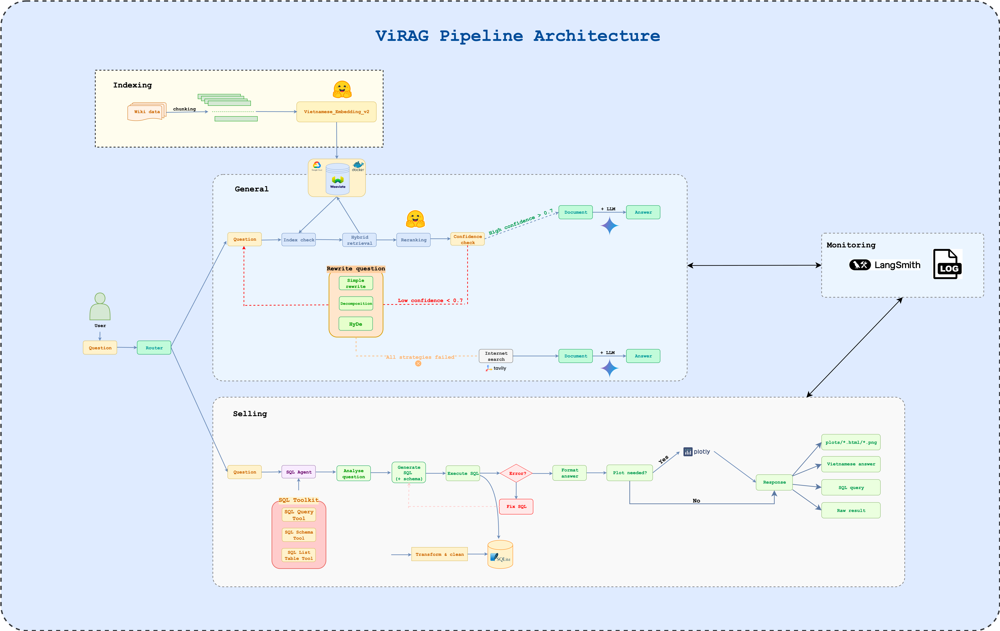

# 🇻🇳 Vietnamese RAG System

<div align="center">


_An advanced Vietnamese Retrieval-Augmented Generation system with intelligent query routing, multi-strategy retrieval, and automatic visualization capabilities._

</div>



## ✨ Features

### 🎯 **Intelligent Query Routing**

- Automatically routes queries between business database and general knowledge
- Vietnamese language understanding and classification

### 🛠️ **Advanced SQL Agent**

- Natural language to SQL conversion for Vietnamese queries
- Automatic error recovery and query optimization
- Smart visualization generation with Plotly

### 🧠 **Multi-Strategy RAG Pipeline**

- **Hybrid Retrieval**: Dense + sparse search combination
- **Query Rewriting**: Simple, decomposition, and HyDE strategies
- **Confidence-based fallback** to web search
- **Document reranking** with multilingual models

### 📊 **Automatic Visualizations**

- Context-aware chart generation
- Interactive Plotly visualizations
- Multiple export formats (HTML, PNG)

### 🌐 **Comprehensive Knowledge Base**

- Vietnamese Wikipedia integration
- GCP-hosted business database
- Web search fallback via Tavily

## 🚀 Quick Start

### Prerequisites

- Python 3.9+
- [uv](https://docs.astral.sh/uv/) package manager
- OpenAI API key
- Access to required external services

### Installation

1. **Clone the repository**

   ```bash
   git clone <your-repo-url>
   cd vietnamese-rag-system
   ```

2. **Navigate to demo and setup environment**

   ```bash
   cd demo-api-layer && \
   uv venv && \
   source .venv/bin/activate && \
   uv sync --active
   ```

3. **Configure environment variables**

   ```bash
   cp sample.env .env
   ```

   Fill in your API keys and configuration in `.env`:

   ```env
   # LLM Configuration
   GEMINI_API_KEY=your_gemini_api_key_here
   OPENAI_API_KEY=your_openai_api_key_here

   # Vector Database
   WEAVIATE_URL=your_weaviate_url_here
   WEAVIATE_API_KEY=your_weaviate_api_key_here

   # Search
   TAVILY_API_KEY=your_tavily_api_key_here

   # LangSmith (Optional)
   LANGCHAIN_API_KEY=your_langchain_api_key_here
   LANGCHAIN_PROJECT=vietnamese_rag
   ```

### Running the Demo

```bash
uv run run.py
```

## 📋 Required API Keys & Services

| Service           | Purpose                               | Required        |
| ----------------- | ------------------------------------- | --------------- |
| **OpenAI API**    | Query rewriting with GPT-4o           | ✅ **Required** |
| **Google Gemini** | Main LLM for response generation      | ✅ **Required** |
| **Weaviate**      | Vector database for knowledge storage | ✅ **Required** |
| **Tavily**        | Web search fallback                   | ✅ **Required** |
| **LangSmith**     | Monitoring and tracing                | ⚪ Optional     |

## 💡 Usage Examples

### Business Queries (SQL Database)

```python
# Vietnamese business questions
query = "Nhân viên nào bán được nhiều nhất tháng 8?"
query = "Doanh thu chi nhánh Hà Nội như thế nào?"
query = "Tạo biểu đồ doanh thu theo tháng"
```

### General Knowledge (Wikipedia + Web)

```python
# General knowledge questions
query = "Lịch sử của Việt Nam như thế nào?"
query = "Trí tuệ nhân tạo là gì?"
query = "Các di sản thế giới ở Việt Nam"
```

## 📁 Project Structure

```
vietnamese-rag-system/
├── src/
│   ├── pipeline/           # RAG pipeline implementations
│   ├── router/             # Query routing logic
│   ├── sql_agent/          # SQL generation and execution
│   ├── retrieval/          # Retrieval and reranking
│   ├── search/             # Web search integration
│   ├── core/               # LLM and embeddings
│   ├── ingestion/          # Data loading and indexing
│   ├── prompts/            # Prompt templates
│   ├── config/             # Configuration management
│   └── utils/              # Helper utilities
├── demo-api-layer/         # Demo application
├── sample.env              # Environment template
└── README.md
```

## 🔧 Configuration

Key configuration parameters in `src/config/settings.py`:

```python
# Model Settings
embedding_model = "AITeamVN/Vietnamese_Embedding_v2"
chunk_size = 1024
chunk_overlap = 50
confidence_threshold = 0.7

# Collections
wikipedia_collection = "VietnameseWikipedia"
```

## 🌟 Key Components

### 1. **Query Router**

Intelligent classification between business and general queries using Gemini 2.0 Flash.

### 2. **SQL Agent**

- Converts Vietnamese to SQL using comprehensive schema knowledge
- Automatic error recovery with 3-retry mechanism
- Generates visualizations for numerical data

### 3. **Enhanced RAG Pipeline**

- Hybrid retrieval (dense + sparse)
- Multi-strategy query rewriting
- BGE-M3 multilingual reranking
- Confidence-based web search fallback

### 4. **Plotting Agent**

- AI-powered visualization code generation
- Context-aware chart type selection
- Multiple export formats

## 📊 System Flow


## 🔍 Advanced Features

- **Multi-language support**: Optimized for Vietnamese
- **Confidence thresholding**: Smart fallback mechanisms
- **Error recovery**: Automatic SQL query fixing
- **Process logging**: Detailed execution tracking
- **Visualization**: Automatic chart generation
- **Monitoring**: LangSmith integration for tracing

## 📝 License

This project is licensed under the MIT License - see the [LICENSE](LICENSE) file for details.

## 🙏 Acknowledgments

- **LangChain** for the RAG framework
- **Weaviate** for vector database capabilities
- **Vietnamese Wikipedia** for knowledge base
- **BGE-M3** for multilingual reranking
- **Plotly** for visualization capabilities

---

<div align="center">

**Built with ❤️ for Vietnamese AI applications**

[](https://github.com/yourusername/vietnamese-rag-system)

</div>
